# Campana de Vacunacion Canina y Felina

Aplicacion movil desarrollada en Flutter con Firebase para gestionar campanas de vacunacion de perros y gatos en distintos sectores del Municipio de Quito.

---

## Capturas de pantalla

### Autenticacion

  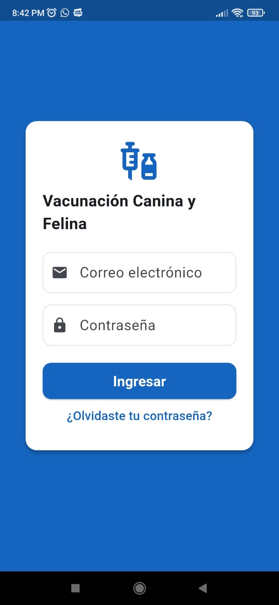
  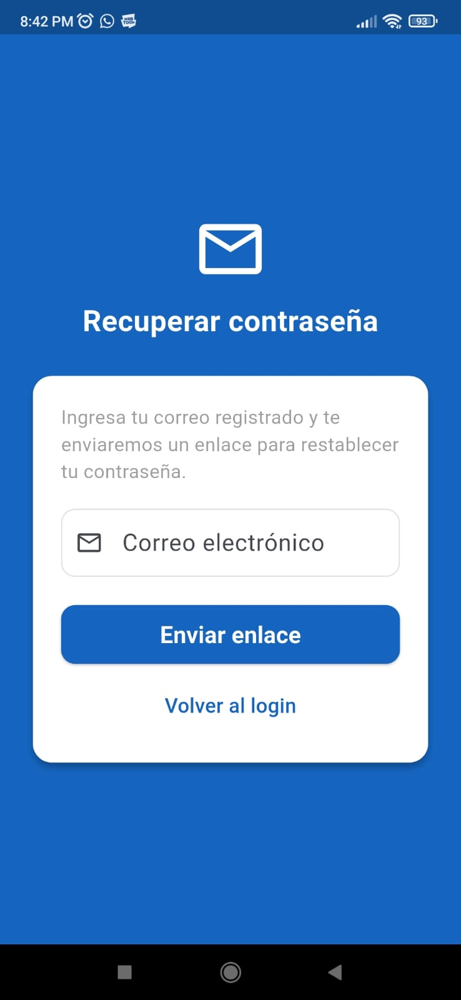

### Coordinador de Campana

  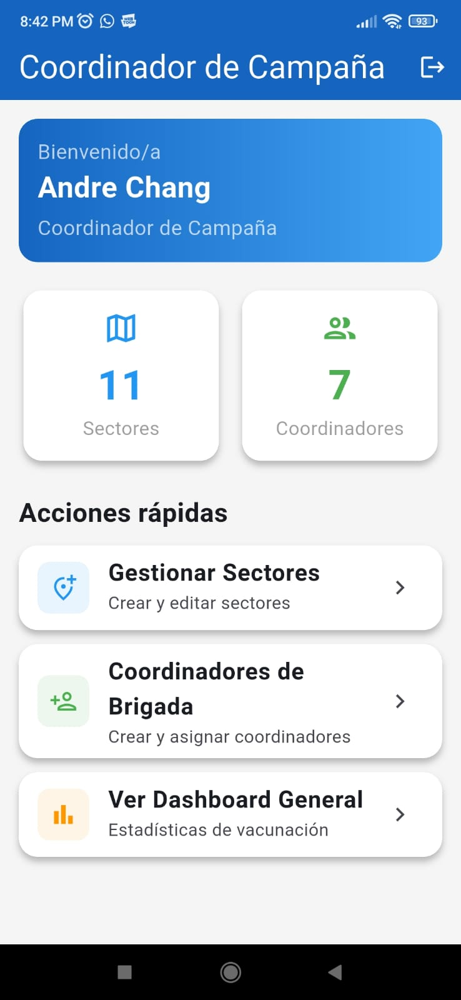
  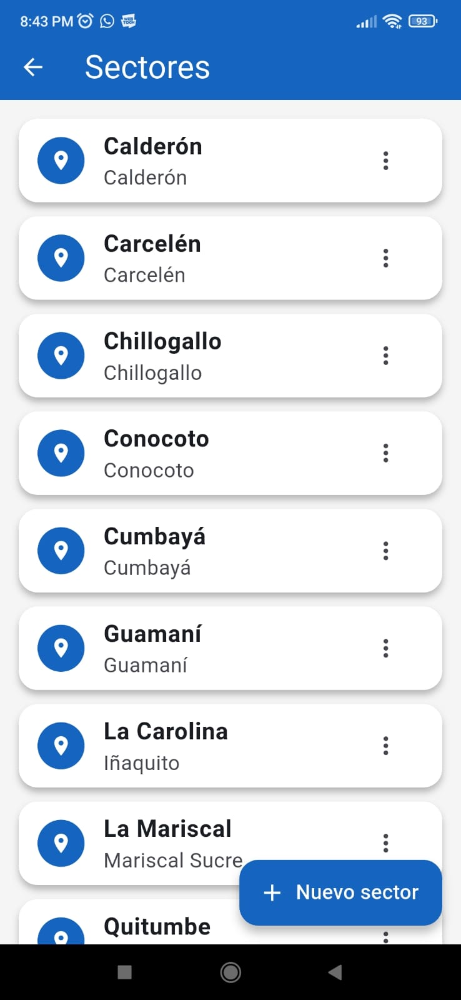
  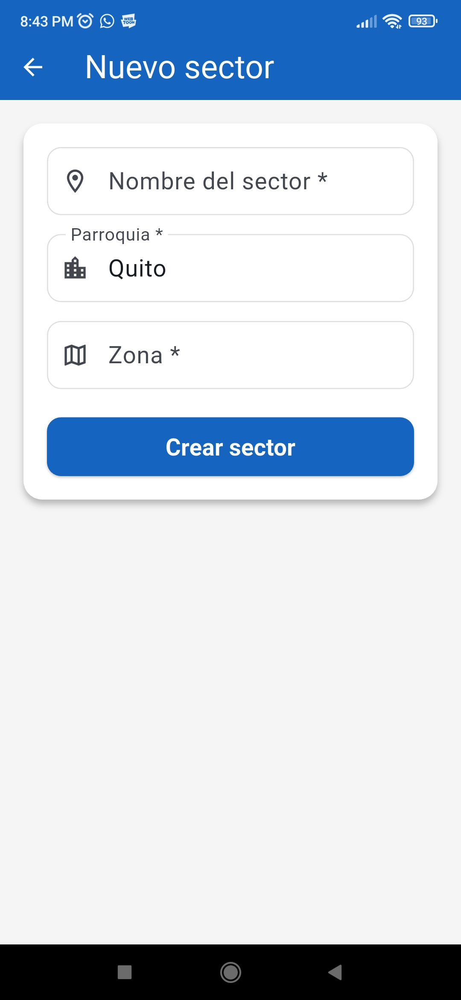

  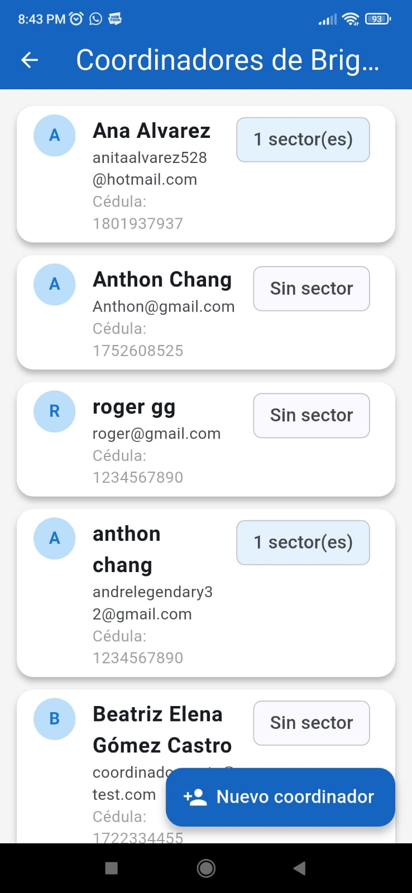
  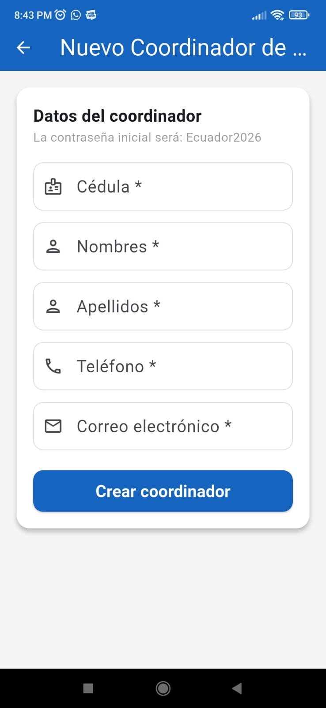

### Coordinador de Brigada

  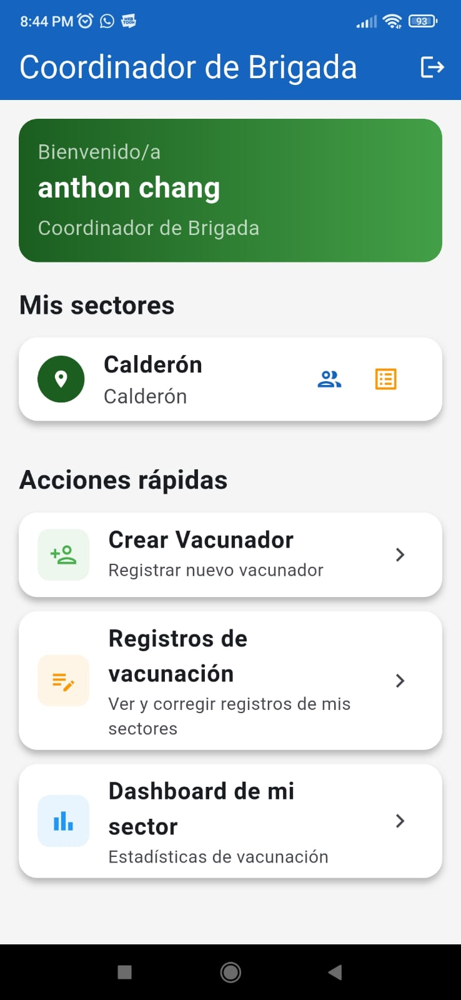
  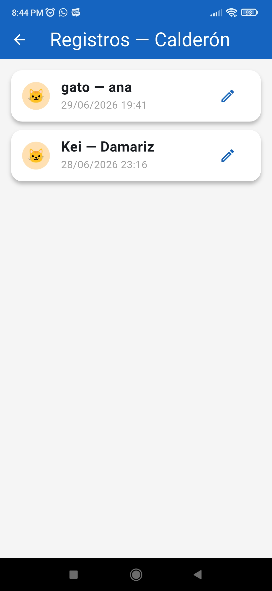
  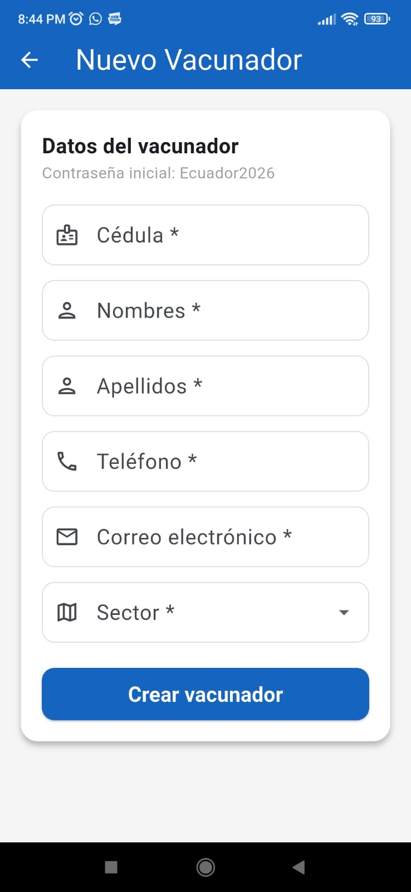

### Vacunador

  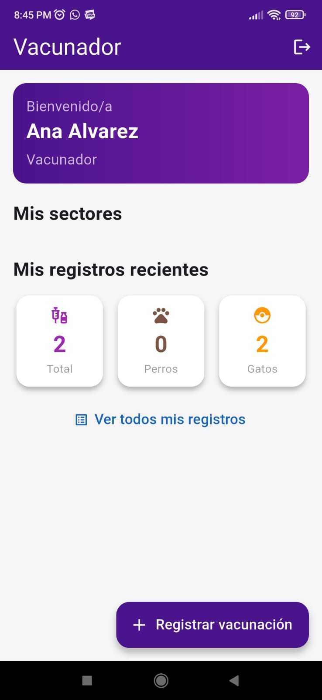
  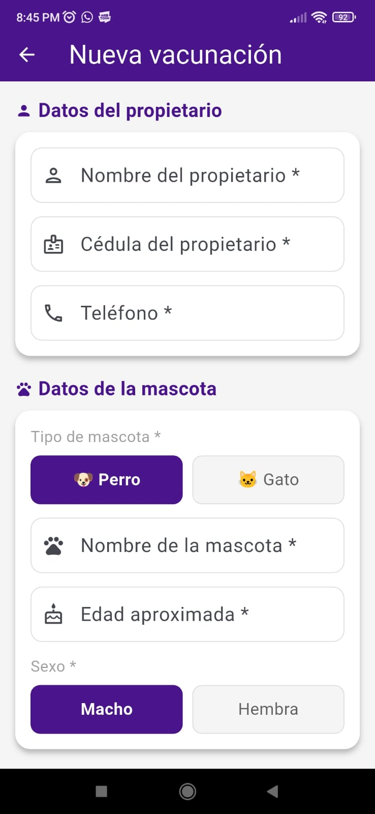

### Dashboard

  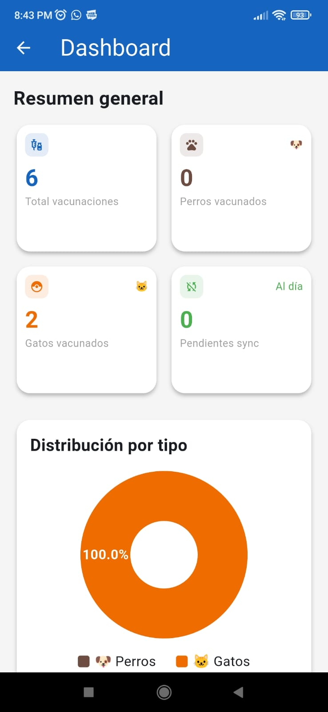
  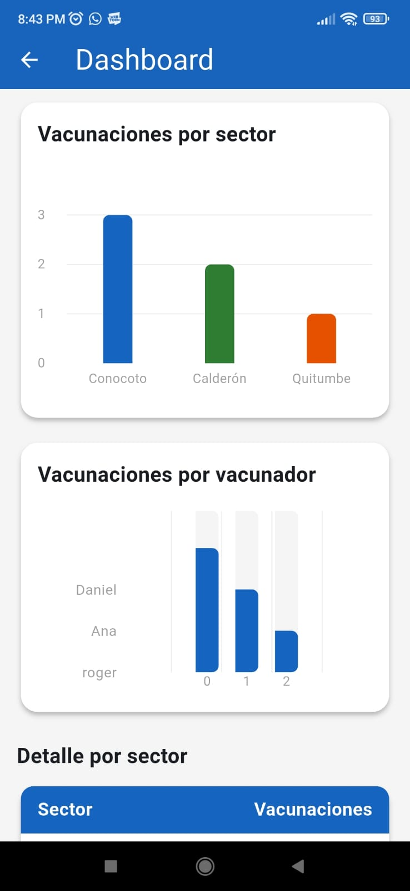

---

## Caracteristicas

- 3 roles de usuario: Coordinador de Campana, Coordinador de Brigada y Vacunador
- Gestion de sectores: Crear, editar y asignar coordinadores
- Gestion de usuarios: Crear coordinadores y vacunadores con contrasena inicial
- Registro de vacunaciones con fotografia y GPS automatico
- Dashboard con graficas de vacunaciones por sector y vacunador
- Cambio obligatorio de contrasena en el primer ingreso
- Recuperacion de contrasena por correo electronico
- Correccion de registros por coordinador de brigada

---

## Tecnologias

| Tecnologia | Uso |
|-----------|-----|
| Flutter 3.44.1 | Framework movil |
| Dart 3.12.1 | Lenguaje de programacion |
| Firebase Auth | Autenticacion de usuarios |
| Cloud Firestore | Base de datos en tiempo real |
| Firebase Storage | Almacenamiento de fotografias |
| Riverpod | Gestion de estado |
| GoRouter | Navegacion |
| fl_chart | Graficas del dashboard |
| Geolocator | Captura de GPS |
| Image Picker | Captura de fotografias |

---

## Instalacion

### Requisitos previos

- Flutter SDK 3.44.1 o superior
- Dart SDK 3.12.1 o superior
- Android SDK 36
- NDK 28.2.13676358
- Java 17 o superior
- Cuenta de Firebase

### Pasos

1. Clonar el repositorio

git clone https://github.com/tu-usuario/vacunacion-canina.git
cd vacunacion-canina

2. Instalar dependencias

flutter pub get

3. Configurar Firebase

- Crea un proyecto en Firebase Console
- Activa Authentication con Email y Password
- Crea Firestore Database
- Activa Storage
- Descarga google-services.json y coloca en android/app/
- Ejecuta flutterfire configure para generar firebase_options.dart

4. Ejecutar la aplicacion

flutter run

---

## Estructura de Firestore

usuarios/{uid}
  - cedula, nombres, apellidos, telefono, correo
  - rol: coordinador_campana | coordinador_brigada | vacunador
  - sectorIds: []
  - primerIngreso: boolean

sectores/{sectorId}
  - nombre, parroquia, zona
  - coordinadorId: uid

vacunaciones/{vacunacionId}
  - propietarioNombre, propietarioCedula, propietarioTelefono
  - tipoMascota: perro | gato
  - nombreMascota, edadAproximada, sexo
  - vacunaAplicada, observaciones
  - fotoUrl, latitud, longitud, fechaHora
  - sectorId, vacunadorId
  - sincronizado: boolean

---

## Roles y funcionalidades

### Coordinador de Campana
- Crear y gestionar sectores
- Crear coordinadores de brigada
- Asignar coordinadores a sectores
- Ver dashboard general con estadisticas

### Coordinador de Brigada
- Ver sectores asignados
- Crear y asignar vacunadores
- Corregir registros de vacunacion de su sector
- Ver dashboard de su sector

### Vacunador
- Ver sectores asignados
- Registrar vacunaciones con foto y GPS
- Editar sus propios registros

---

## Credenciales de prueba

| Rol | Correo | Contrasena |
|-----|--------|------------|
| Coordinador de Campana | coordinador@vacunacion.com | tu contrasena |
| Coordinador de Brigada | andrelegendary32@gmail.com | tu contrasena |
| Vacunador | anitaalvarez528@hotmail.com | tu contrasena |

La contrasena inicial para usuarios creados desde la app es Ecuador2026. El sistema obliga a cambiarla en el primer ingreso.

---

## Estructura del proyecto

lib/
├── core/
│   ├── router/
│   └── theme/
├── data/
│   ├── local/
│   ├── repositories/
│   └── services/
├── domain/
│   └── entities/
└── presentation/
    ├── providers/
    └── screens/
        ├── auth/
        ├── coordinador_campana/
        ├── coordinador_brigada/
        ├── vacunador/
        └── dashboard/

---

## APK

Puedes descargar el APK en la seccion de Releases del repositorio.

---

## Autor

Anthon Chang
Tecnologia Superior en Desarrollo de Software
2026